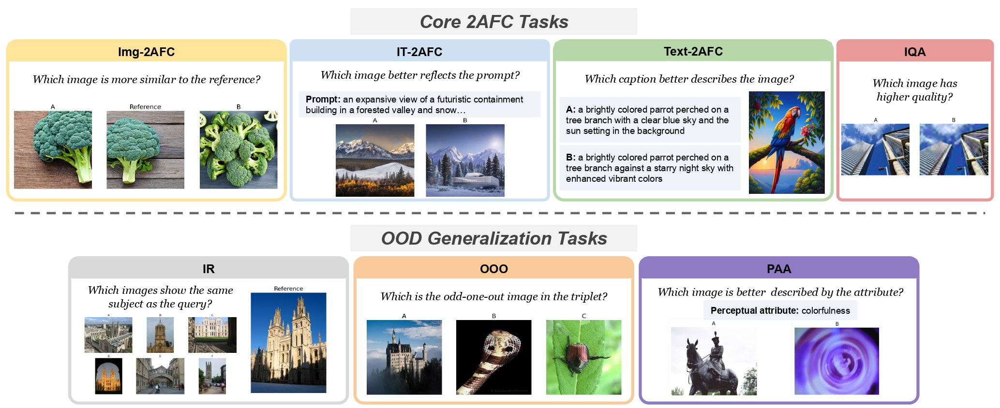
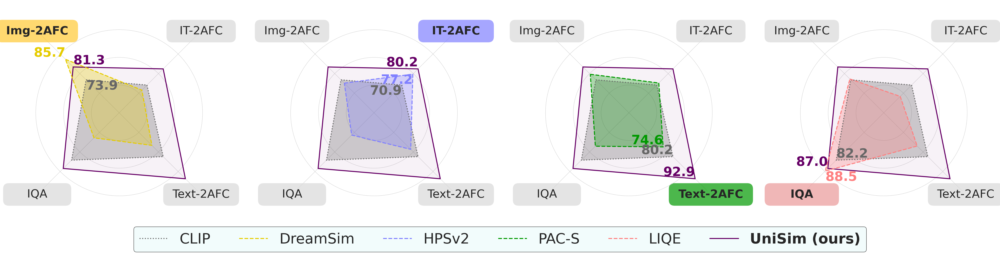
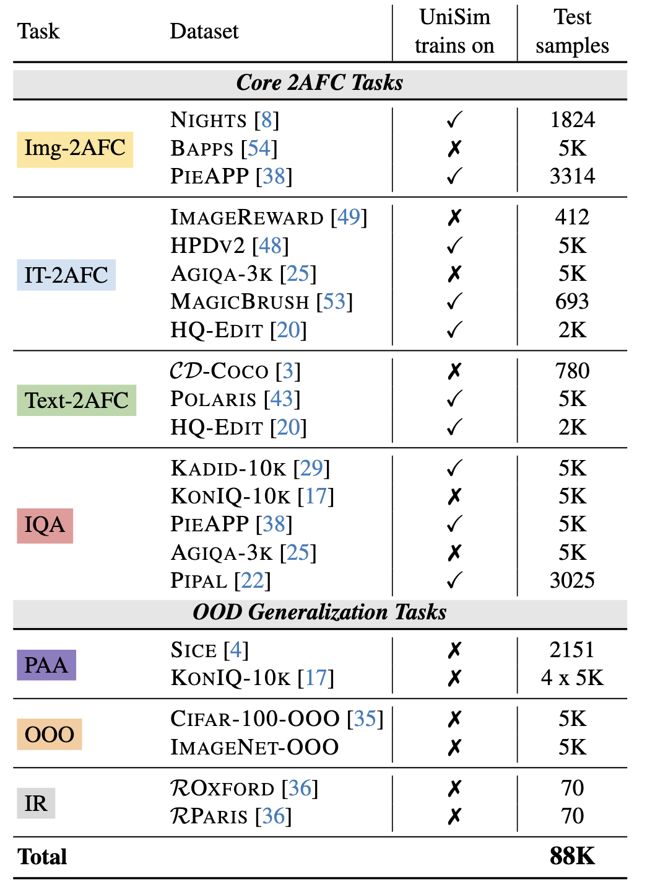

# UniSim: Towards Unified Benchmark and Models for Multi-Modal Perceptual Metrics

### [Paper](https://arxiv.org/abs/2412.10594) | [Dataset](#data) | [Checkpoints](#checkpoints) | [Quick Start](#quick) | [Acknowledgement](#ack) 

<div align="center">

</div>


The key contributions and findings of our work are as follows:

- We introduce **UniSim-Bench**, a comprehensive benchmark spanning **7 multi-modal perceptual similarity tasks** and encompassing 25 datasets.

- Our evaluation demonstrates that while general-purpose models perform reasonably well on average, they often fall short compared to specialized models on specific tasks.

- In contrast, metrics fine-tuned for individual tasks show strong performance but fail to generalize effectively to unseen, yet related, tasks.

- To address this gap, we propose **UniSim, a family of multi-task perceptual similarity metrics** designed as a first step toward a unified framework for perceptual similarity.

- UniSim leverages fine-tuning of both encoder-based and generative vision-language models on a subset of tasks from UniSim-Bench, achieving the highest average performance. Notably, it even surpasses task-specific models in certain cases.

- Despite these advancements, our findings reveal that the models continue to struggle with generalization to unseen tasks, underscoring the persistent challenge of developing a robust, unified perceptual similarity metric that aligns with human notions of similarity.
  
<div align="center">

</div>


<a name="data"></a>
### Dataset
We collect and adapt multiple existing datasets for each tasks, as detailed in the table below. A subset of datasets from the *Core 2AFC Tasks* are then used to train our UniSim models (see below), while the others are held-out for evaluation only. Moreover, all datasets from the *OOD Generalization Tasks* are only used at test time.
The UniSim-Bench data can be found [here](https://huggingface.co/datasets/saraghznfri/unisim_data) on HuggingFace.

<div align="center">

</div>


<a name="checkpoints"></a>
### Checkpoints

We train three versions of our multi-task perceptual metric UniSim:
- [UniSim_ViT_b_32](https://drive.google.com/file/d/1z8fQ3KSrih-diYqm9O_NazotlFTo8fN3/view?usp=sharing), where we fine-tune the vision encoder (ViT-B/32) of [laion/CLIP-ViT-B-32-laion2B-s34B-b79K](https://huggingface.co/laion/CLIP-ViT-B-32-laion2B-s34B-b79K)
- [UniSim_ViT_l_14](https://drive.google.com/file/d/1exLFqZvantuiu4yx2FtdGb8OcolvFg_f/view?usp=sharing), where we fine-tune the vision encoder (ViT-L/14) of [openai/clip-vit-large-patch14](https://huggingface.co/openai/clip-vit-large-patch14)
- [UniSim_ll_n_0.5b](https://drive.google.com/file/d/1jvvjmn0AFyyGHXXqi4m5NcUATzKRz5Ug/view?usp=sharing), where we fine-tune [LLaVA-NeXT-0.5B](https://huggingface.co/lmms-lab/llava-next-interleave-qwen-0.5b)

<a name="quick"></a>
### Quick Start

- Loading models 
  
```python
from models import load_unisim_models
load_unisim_models(model_name, model_path, device, cache_dir)
```
```model_name``` should be chosen from ```['unisim_vit_b_32', 'unisim_vit_l_14', 'unisim_ll_n_0.5']```.

- Quick use of the UniSim metrics:

```python
from models import get_unisim_metric
get_unisim_metric(model_name, model_path, task_type, images, texts, device, cache_dir)
```

Here is an example:
```python
model_name = 'unisim_ll_n_0.5'
model_path = 'path/to/model'
device='cuda:0'
cache_dir='./'

images = ['/uni_data/nights/ref/000/002.png',
          '/uni_data/nights/distort/000/002_0.png', 
          '/uni_data/nights/distort/000/002_1.png']
texts = []
task_type = 'Img_2AFC'
pred = get_unisim_metric(model_name, model_path, task_type, images, texts, device, cache_dir)

print(f'Task: {task_type}, Pred: {pred}')
```
<a name="ack"></a>
### Acknowledgement

This work leverages the code and resources from [OpenCLIP](https://github.com/mlfoundations/open_clip) and [LLaVA-Next](https://github.com/LLaVA-VL/LLaVA-NeXT) repositories. Moreover, we use several existing datasets, whose details and references can be found in our paper.

We thank the authors of these repositories and datasets for making their work publicly available and contributing to the research community.

<a name="bibtex"></a>
### Citation
If you use our code or models, please consider citing our work using the following BibTex entry:
```bibtex
...
```
