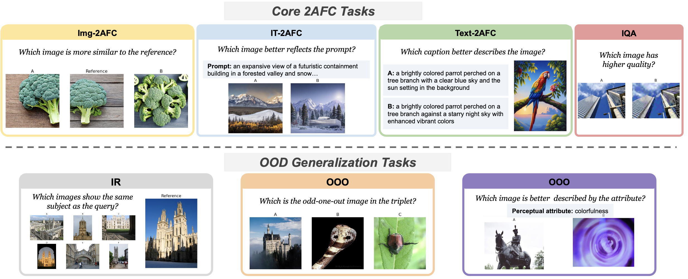

# UniSim: Towards Unified Benchmark and Models for Multi-Modal Perceptual Metrics

### [Paper]() | [Dataset](#data) | [Checkpoints](#checkpoints) | [Acknowledgement](#ack) 

The key contributions and findings of our work are as follows:

- We introduce UniSim-Bench, a comprehensive benchmark spanning 7 multi-modal perceptual similarity tasks and encompassing 25 datasets.

- Our evaluation demonstrates that while general-purpose models perform reasonably well on average, they often fall short compared to specialized models on specific tasks.

- In contrast, metrics fine-tuned for individual tasks show strong performance but fail to generalize effectively to unseen, yet related, tasks.

- To address this gap, we propose UniSim, a family of multi-task perceptual similarity metrics designed as a first step toward a unified framework for perceptual similarity.

- UniSim leverages fine-tuning of both encoder-based and generative vision-language models on a subset of tasks from UniSim-Bench, achieving the highest average performance. Notably, it even surpasses task-specific models in certain cases.

- Despite these advancements, our findings reveal that the models continue to struggle with generalization to unseen tasks, underscoring the persistent challenge of developing a robust, unified perceptual similarity metric that aligns with human notions of similarity.
  

### Dataset
HuggingFace [link](https://huggingface.co/datasets/saraghznfri/unisim_data) for the UniSim-Bench data.

### Checkpoints

- [UniSim_ViT_b_32](https://drive.google.com/file/d/1z8fQ3KSrih-diYqm9O_NazotlFTo8fN3/view?usp=sharing)
- [UniSim_ViT_l_14](https://drive.google.com/file/d/1exLFqZvantuiu4yx2FtdGb8OcolvFg_f/view?usp=sharing) 
- [UniSim_ll_n_0.5b](https://drive.google.com/file/d/1jvvjmn0AFyyGHXXqi4m5NcUATzKRz5Ug/view?usp=sharing) 

### Acknowledgement

This work leverages the code and resources from [OpenCLIP](https://github.com/mlfoundations/open_clip) and [LLaVA-Next](https://github.com/LLaVA-VL/LLaVA-NeXT) repositories:

We thank the authors of these repositories for making their work publicly available and contributing to the research community.
